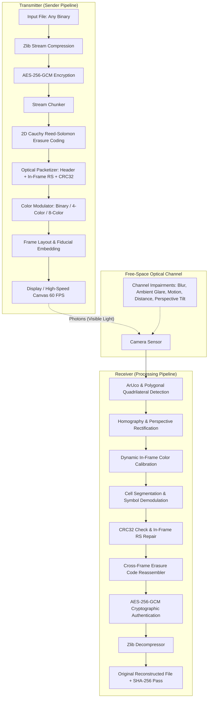

# OptiLink — System Architecture & Design Specification

## 1. System Overview

OptiLink is an experimental contactless optical wireless communication (OWC) system that transfers arbitrary binary files from a computer display to an optical sensor (webcam or mobile camera) using high-speed modulated 2D color patterns.



---

## 2. Layered Architecture

OptiLink strictly decouples application data, cryptography, transport error coding, and physical visual optics:

```text
┌────────────────────────────────────────────────────────┐
│ Layer 5: Application Layer                             │
│ Arbitrary File I/O, Streaming Chunking, MIME detection │
├────────────────────────────────────────────────────────┤
│ Layer 4: Cryptographic & Compression Layer             │
│ Authenticated AES-256-GCM Encryption + Zlib Deflate    │
├────────────────────────────────────────────────────────┤
│ Layer 3: Transport & Reliability Layer                 │
│ 2D Cross-Frame Reed-Solomon Erasure Coding + CRC-32    │
├────────────────────────────────────────────────────────┤
│ Layer 2: Optical Protocol & Framing Layer              │
│ 25-byte Fixed Header, In-Frame RS(N,K), Frame Types    │
├────────────────────────────────────────────────────────┤
│ Layer 1: Physical Optical Modulation Layer             │
│ Binary / 4-Color / 8-Color Palettes, Grid Synthesis,   │
│ ArUco Fiducials, Perspective Rectification             │
└────────────────────────────────────────────────────────┘
```

---

## 3. Subsystem Breakdown

### 3.1 Optical Transmit Pipeline (`optilink.sender`)
- `file_reader.py`: Memory-efficient chunked streaming reader capable of processing multi-gigabyte files without memory spikes.
- `compressor.py`: Dynamic zlib compressor; automatically bypasses compression if the compressed file size exceeds raw bytes (e.g. pre-compressed ZIP, MP4, JPEG).
- `encryptor.py`: High-grade AES-256-GCM authenticated cipher with a fresh 96-bit cryptographic nonce and 128-bit authentication tag.
- `chunker.py`: Uniformly divides ciphertexts to match optical frame capacity.
- `transmitter.py`: Central engine generating Announce, Source Data, Parity, and EOT frames.

### 3.2 Visual Modulation & Frame Geometry (`optilink.optical`)
- `frame_layout.py`: Spatial coordinate planner that reserves corner regions for fiducials and top row for reference colors while allocating data cells.
- `colors.py`: Defines color coordinates in RGB space:
  - **Mode 1 (Binary):** Black, White (1 bit/cell).
  - **Mode 2 (4-Color):** Black, Red, Green, Blue (2 bits/cell).
  - **Mode 3 (8-Color):** Black, Blue, Green, Cyan, Red, Magenta, Yellow, White (3 bits/cell).
- `calibration.py`: Dynamically samples the top calibration strip to calculate real-time RGB reference values, neutralizing ambient light drift and camera auto-white-balance.
- `frame_generator.py`: Generates pixel-perfect raster frames with embedded ArUco corner fiducials and registration boxes.

### 3.3 Computer Vision & Receiver (`optilink.receiver`)
- `detector.py`: Detects markers IDs 0, 1, 2, 3 at sub-pixel accuracy with fallback to convex 4-corner contour analysis.
- `perspective.py`: Applies 4-point homography (`cv2.warpPerspective`) into a canonical $512 \times 512$ coordinate frame.
- `color_decoder.py`: Samples center 50% median of each cell to eliminate noise and classifies observed colors using perceptual Euclidean distance.
- `reassembler.py`: Manages packet streams, resolves erasures via cross-frame Reed-Solomon, authenticates ciphertext, and verifies SHA-256.

### 3.4 Adaptive Rate Control (`optilink.adaptive`)
- `engine.py`: Evaluates sliding-window bit error rate (BER), dropped frame rate, and color confidence to dynamically scale modulation modes (Binary $\leftrightarrow$ 4-Color $\leftrightarrow$ 8-Color) and grid densities ($24 \times 24 \leftrightarrow 32 \times 32 \leftrightarrow 48 \times 48$).
